## 参考网站

[参考教程网站](https://daheiai.com/cc-install.html)

## 安装 Git

[Git 安装官方教程](https://git-scm.com/book/zh/v2/%E8%B5%B7%E6%AD%A5-%E5%AE%89%E8%A3%85-Git)

## 安装 Claude Code 本体

### 1. 开始安装

在开始菜单中搜索**管理员终端**（PowerShell），复制以下命令并回车：

```bash
irm https://daheiai.com/cc.ps1 | iex
```

等待下载完成，大约需要 30 分钟左右。

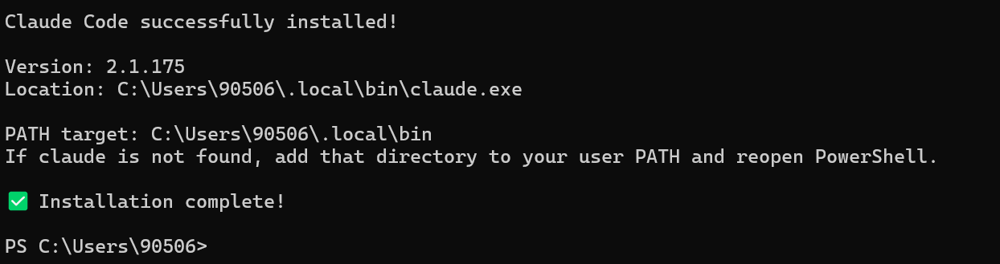

安装完成后会显示安装目录所在位置，例如：

```
C:\Users\90506\.local\bin\claude.exe
```

可以通过复制这一行命令来启动 Claude，也可以将其配置到环境变量中，这样直接输入 `claude` 即可启动。

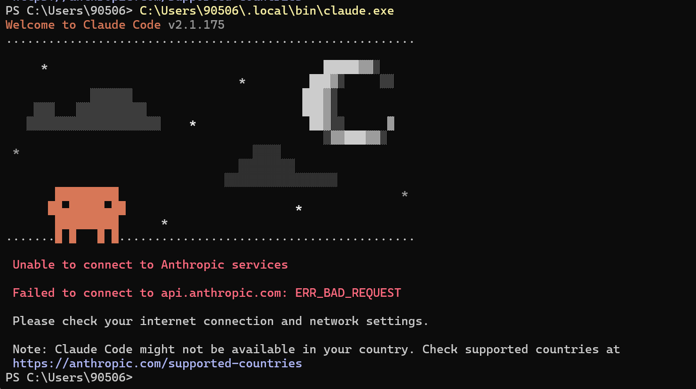

这里报错是正常的，说明还需要接入 API。接下来下载 CC-Switch。

### 2. 下载 CC-Switch

CC-Switch 是一个用于管理模型的多功能工具。

[Windows 下载 CC-Switch](https://wwayc.lanzoub.com/iiHKV3n29yhe)

点击上方链接下载 CC-Switch，下载完成后桌面会自动添加快捷方式。

### 3. 购买 DeepSeek 模型

[API 开放平台](https://platform.deepseek.com/usage)

点击上方链接，或从 DeepSeek 官网进入 API 开放平台，根据页面提示登录并充值一定额度。

### 4. 创建 API Key


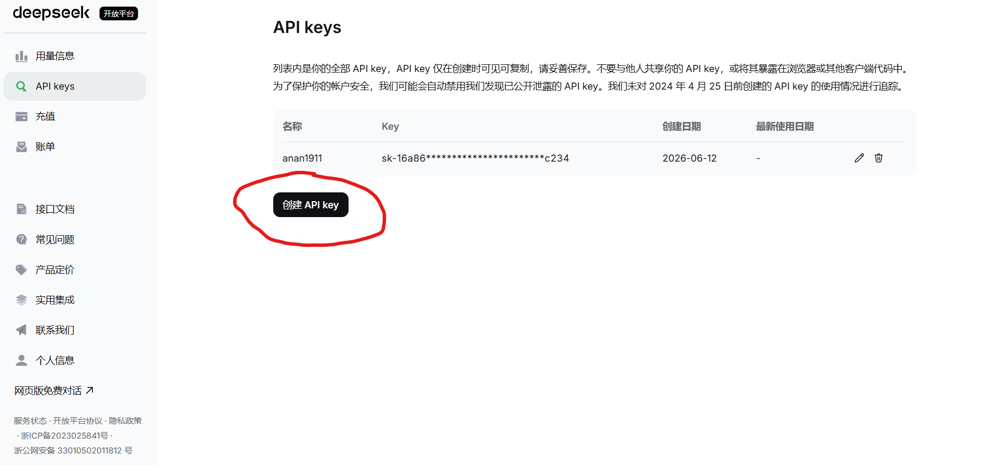

点击左侧的 **API keys**，再点击**创建 API key**，名称随意填写。创建完成后会显示 API Key，**注意：Key 仅在创建时显示一次**，请务必复制并妥善保存。如果丢失，只能重新创建。

### 5. 在 CC-Switch 中添加模型

打开 CC-Switch，点击 **+** 号：

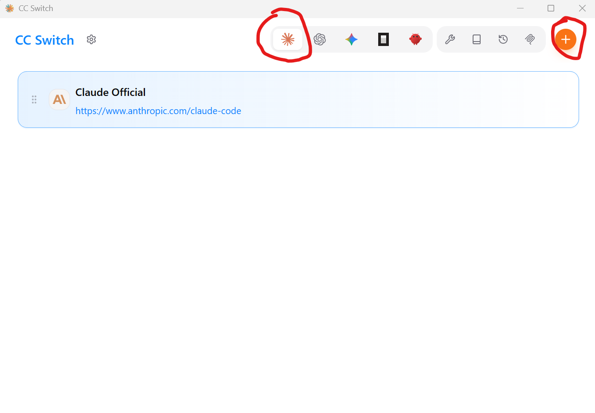

选择 DeepSeek 并点击添加：

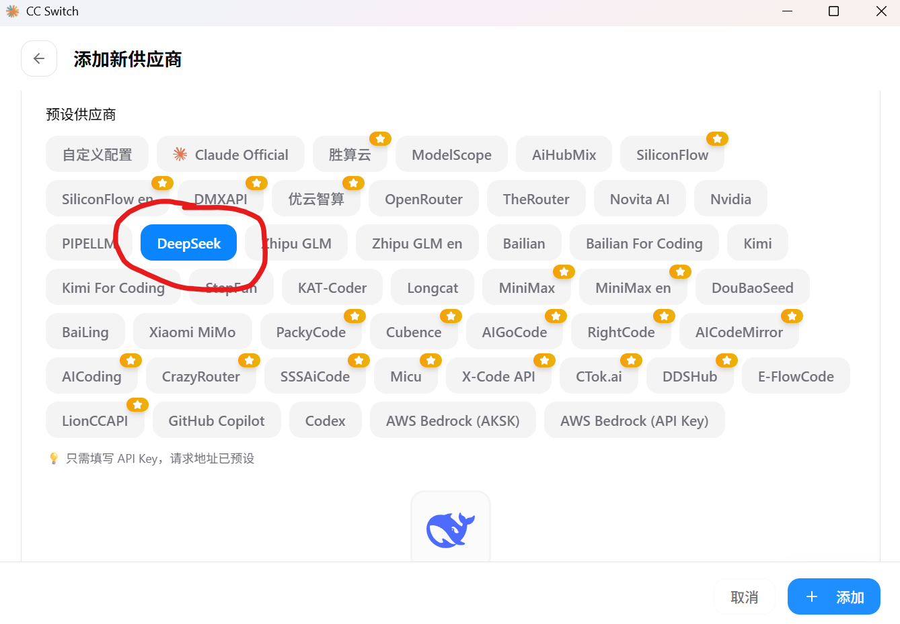

向下滑动，将前面创建的 API Key 粘贴到这里：

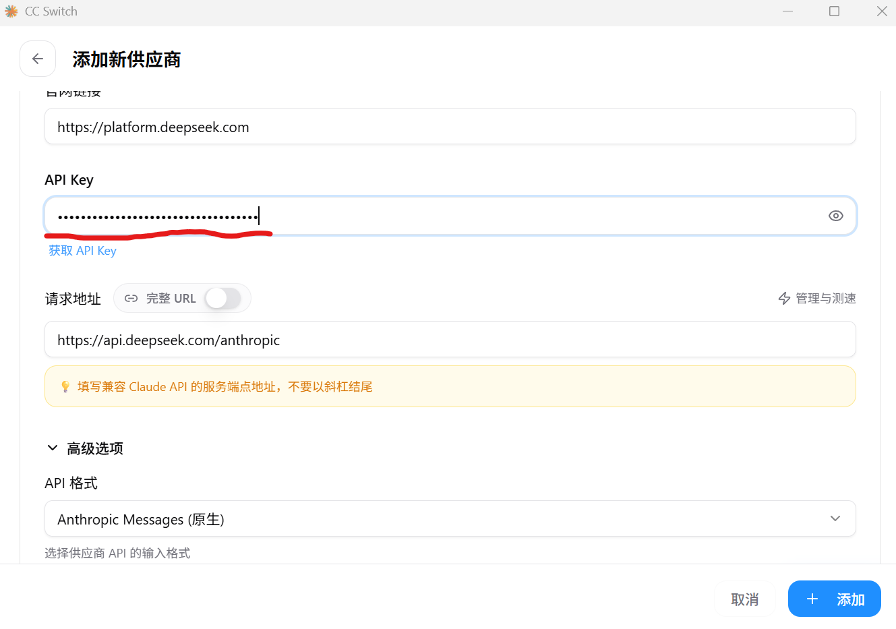

继续向下滑动，选择最新的 `DeepSeek-V4-pro`，参考下图填写后点击添加：

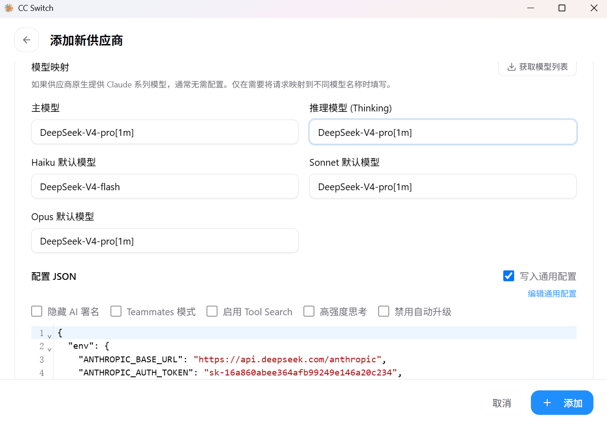

点击**测试模型**，出现"运行正常"的提示即为成功。点击右侧的**配置用量查询**，可以显示账户余额：

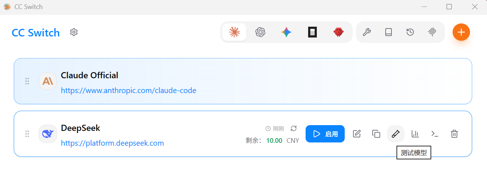

在设置中还可以开启开机自启：

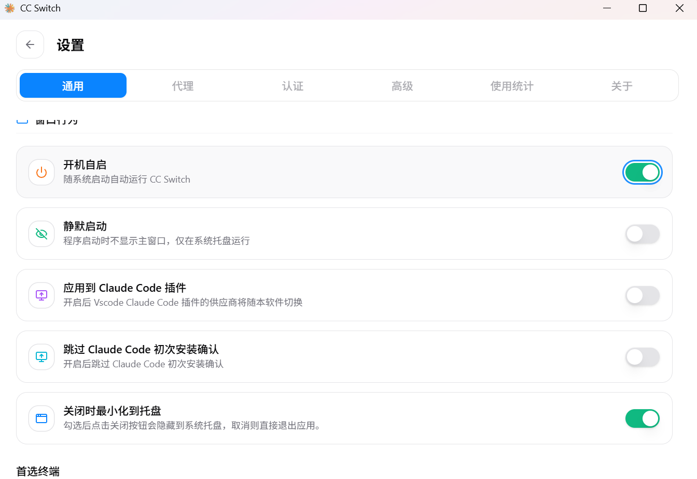

现在重新打开 Claude，显示出选择风格的页面即为配置成功，一路回车即可：

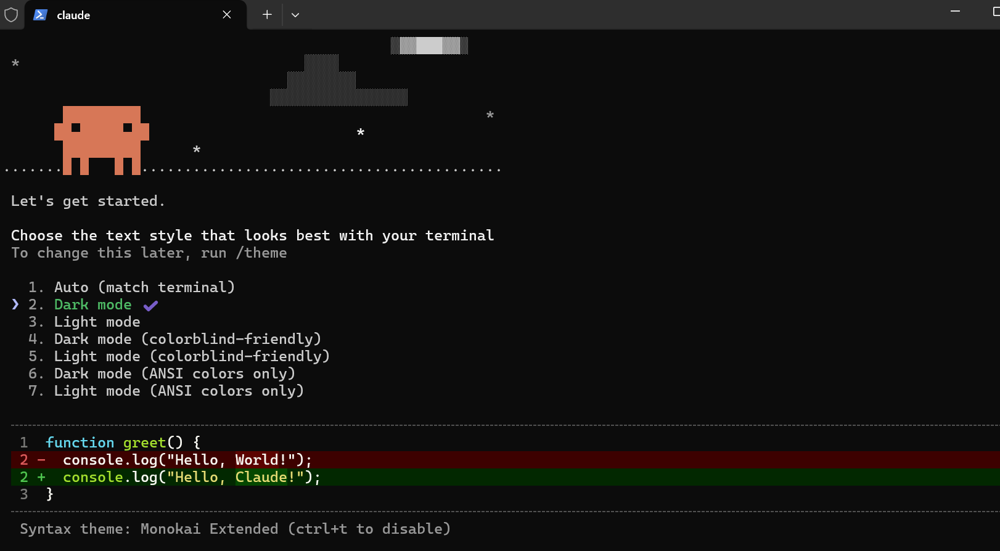

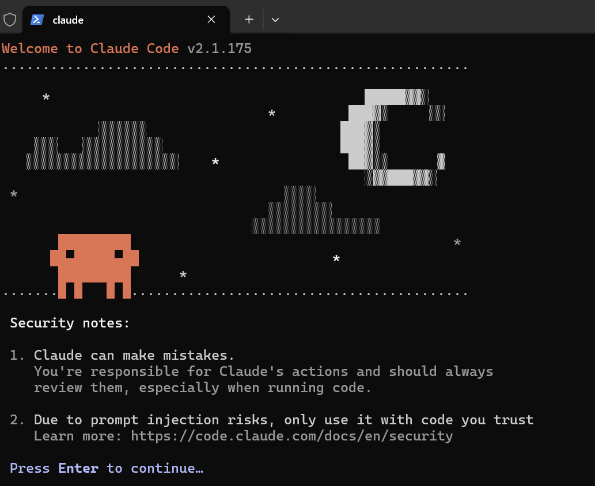

输入 `/context` 命令可以查看相关信息：

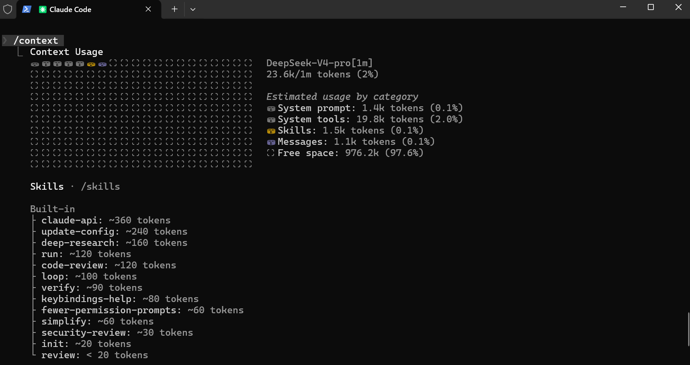

```bash
/effort auto      # 自动调整思考等级
/effort max       # 调整思考等级到最高
/effort low       # 调整思考等级到最低
```

输入 `/effort` 加空格，可以查看所有可选的思考等级。

### 6. 在 VS Code 中使用

在 VS Code 中安装 Claude 插件，即可直接在编辑器中使用：

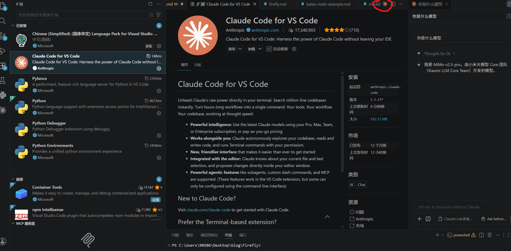

